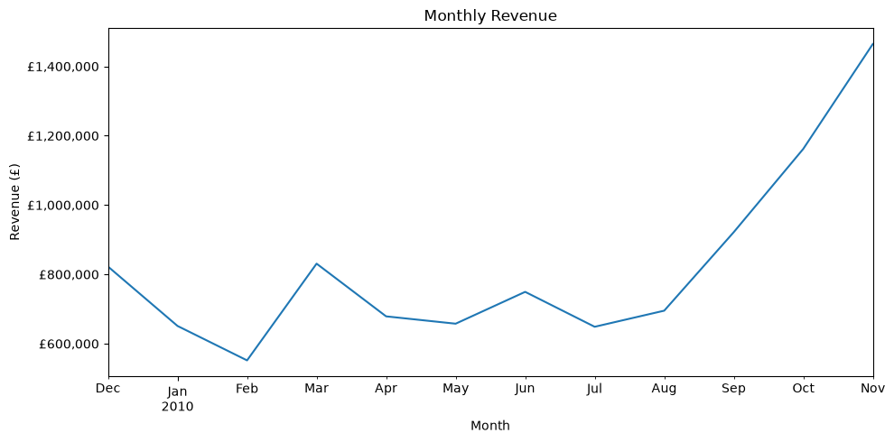
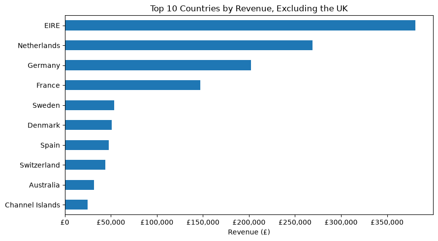

# Retail Data Platform

## Project Overview

This project explores the UCI Online Retail II dataset using Python. It currently includes data quality assessment, data cleaning, exploratory data analysis and data visualisation. Future versions will extend the project with SQL, dashboards, machine learning and data engineering features.

## Dataset

The current version of the project uses the 2009–2010 transaction data from the UCI Online Retail II dataset. The original dataset spans two years (2009–2011). The second year of data (2010–2011) will be used for later stages of the project to demonstrate automated data ingestion and pipeline processing.

Download the dataset from the [UCI Machine Learning Repository](https://archive.ics.uci.edu/dataset/502/online+retail+ii) and place `online_retail_II.xlsx` in:

`data/raw/online_retail/`

## Repository Structure

```text
retail-data-platform/
├── assets/
│   ├── monthly_revenue_trend.png
│   └── top_countries_excluding_uk.png
├── data/
│   ├── raw/
│   │   └── online_retail/
│   └── processed/
├── notebooks/
│   └── 01_data_exploration.ipynb
├── sql/
│   ├── schema.sql
│   └── analysis_queries.sql
├── scripts/
├── .gitignore
├── README.md
└── requirements.txt
```

Additional SQL scripts, dashboards and pipeline components will be added as the project develops.

## Installation

1. Clone the Repository

```bash
git clone https://github.com/sch-data/retail-data-platform.git
cd retail-data-platform
```
2. Create a Virtual Environment

```
python -m venv .venv
source .venv/bin/activate #Linux/MacOS
```
3. Install Dependencies

```
pip install -r requirements.txt
```
4. Open `notebooks/01_data_exploration.ipynb` in Jupyter or VS Code.

## Current Progress

- Data quality assessment
- Data cleaning and preprocessing
- Exploratory data analysis
- Data visualisation
- Initial PostgreSQL schema design

## Example visualisations

### Monthly Revenue Trend



### Top 10 Countries by Revenue (Excluding UK)



## Key Findings

- December 2010 contained only the first nine days of transactions and was excluded from monthly trend analysis.
- Duplicate records, cancelled or returned transactions, and three bad debt adjustment records were identified and removed during data cleaning.
- Revenue increased substantially between September and November 2010, indicating strong seasonal demand ahead of the holiday period.
- The United Kingdom generated the vast majority of total revenue, with the Republic of Ireland and the Netherlands as the largest international markets.
- Most orders were of relatively low value, with only a small number of exceptionally large orders.

## Roadmap

Future development of the project will include:

- Build a relational database and analyse the cleaned dataset using SQL to answer business questions.
- Develop an interactive dashboard to communicate key sales metrics.
- Build an automated data processing pipeline.
- Extend the project with predictive modelling.
- Deploy the data pipeline using a cloud platform.

## Licence & Attribution

This project uses the Online Retail II dataset from the UCI Machine Learning Repository.

- Source: UCI Machine Learning Repository
- Dataset: [UCI Online Retail II](https://archive.ics.uci.edu/dataset/502/online+retail+ii)
- Creator: Dr Daqing Chen
- DOI: 10.24432/C5CG6D
- Licence: CC BY 4.0